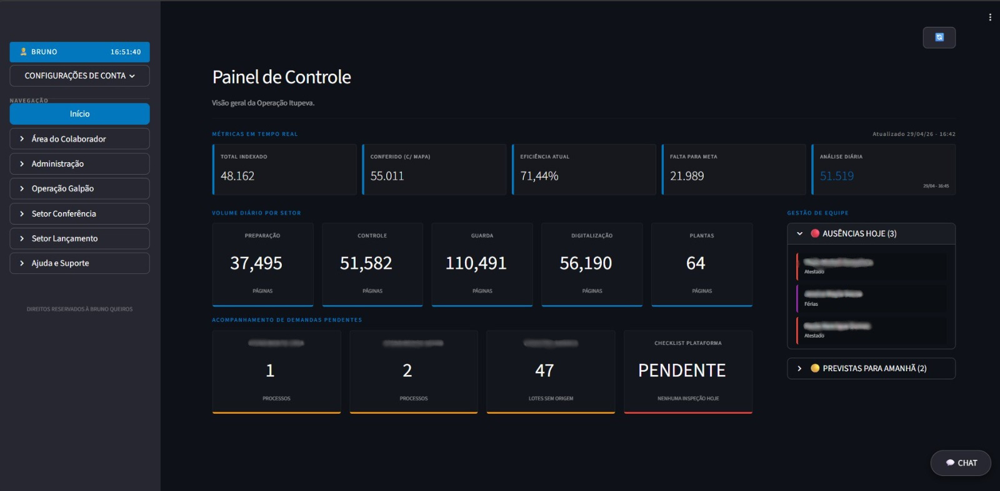
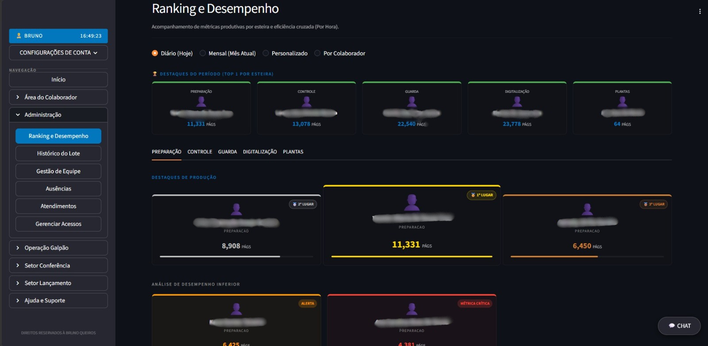
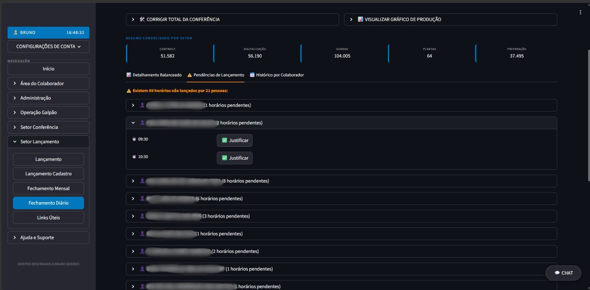
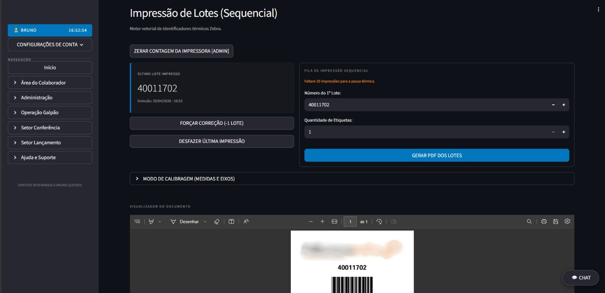

# 🏢 Sistema Integrado de Gestão Operacional & BPO (AI-Driven Development)

> 🔒 **Nota de Confidencialidade:** Este é um repositório de portfólio focado em arquitetura de software, Integração de IA e regras de negócio corporativas. O código-fonte é proprietário (NDA). As imagens contêm dados ofuscados para preservar informações sensíveis.

## 📌 O Desafio
Operações de processamento de documentos (BPO) lidam com volumes massivos de dados, gargalos logísticos e a necessidade de microgerenciamento de equipes. O desafio era unificar o acompanhamento de metas, auditoria de galpão, controle de ponto e emissão de hardware (impressoras térmicas) em uma **única plataforma web centralizada, ágil e à prova de falhas humanas**.

## 💡 A Solução (Construída com AI-First)
Atuando como **Arquiteto de Soluções e Prompt Engineer**, orquestrei o desenvolvimento desta aplicação full-stack (Python/Streamlit) utilizando metodologias de **AI-Driven Development**. Através de engenharia de prompts avançada, guiei Modelos de Linguagem (LLMs) para estruturar a arquitetura, escrever lógicas complexas de manipulação de dados (Pandas) e criar uma interface altamente responsiva. O resultado é um sistema que elimina planilhas e entrega "Inteligência Operacional em Tempo Real".

---

## 🤖 Engenharia de IA & Metodologia
O grande diferencial deste projeto não é apenas o código, mas **como** ele foi gerado e integrado com Inteligência Artificial:

* **Desenvolvimento Guiado por IA:** Tradução de regras de negócio complexas de BPO para prompts estruturados, permitindo o desenvolvimento rápido de módulos de faturamento, cálculo de SLAs e integração de hardware (motor de impressão vetorial Zebra).
* **LLM Integration (Google Gemini):** Implementação de um módulo laboratorial consumindo a API do Gemini. Substituição de buscas tradicionais por **Raciocínio Semântico**: a IA analisa os inputs do usuário, cruza com a Tabela de Temporalidade Documental (TTD) baseada no CONARQ e devolve pareceres analíticos justificados.
* **Computer Vision (EasyOCR + IA):** Implementação de fluxo de leitura de imagem da capa de processos via área de transferência (Ctrl+V), onde a IA extrai o contexto textual e sugere a classificação processual automaticamente.
* **Troubleshooting Dinâmico:** Uso contínuo de IA generativa para debug de erros complexos, injeção de CSS para customização avançada de UI e otimização de performance de cache.

---

## 🚀 Funcionalidades Principais (Módulos)

### 1. Painel de Controle (Real-Time Dashboard)
Monitoramento ao vivo da "saúde" da operação. 
* **Métricas Dinâmicas:** Acompanhamento do Total Indexado, Eficiência Atual (%) e Volume faltante para atingir a meta do dia.
* **Gestão de Pessoas Integrada:** Painel lateral cruzando ausências, férias e atestados, permitindo remanejamento imediato da equipe.

---

### 2. Gamificação e Ranking de Desempenho
Transformando pressão operacional em engajamento baseado em dados.
* **Pódio Dinâmico e Alertas:** Destaque automático para os colaboradores mais produtivos e alertas visuais (Métrica Crítica) para identificar gargalos em tempo real.

---

### 3. Fechamento Diário e Auditoria de Pendências (Leakage)
Consolidação inteligente de dados para faturamento e controle rígido de SLAs.
* **Detalhamento Balanceado:** Cruzamento de horas trabalhadas versus volume produzido, gerando a eficiência individual.
* **Radar de Horas Esquecidas:** Mapeamento de buracos na produção, exigindo justificativa obrigatória na plataforma para estancar vazamentos de faturamento.

---

### 4. Integração de Hardware (Motor de Impressão Zebra)
A ponte robusta entre o software e o chão de fábrica (Galpão).
* **Fila Sequencial Inteligente e Segura:** Geração de PDFs em tempo real com código de barras, com memória global de numeração e trava de segurança para evitar queima da cabeça de impressão térmica após volume excessivo.

---

## 📈 Impacto no Negócio
* **Redução de SLA de Gestão:** Decisões de alocação de equipe que demoravam horas agora são tomadas em segundos.
* **Aumento de Receita:** O módulo de pendências reduziu o vazamento de horas não lançadas, garantindo o faturamento correto da produção.
* **Modernização Tecnológica:** Inserção de IA Generativa no dia a dia da operação de BPO, elevando o nível de análise da equipe de base.

---
*Arquitetado, Orquestrado e Desenvolvido por **Bruno Queiros** usando metodologias AI-First.*
